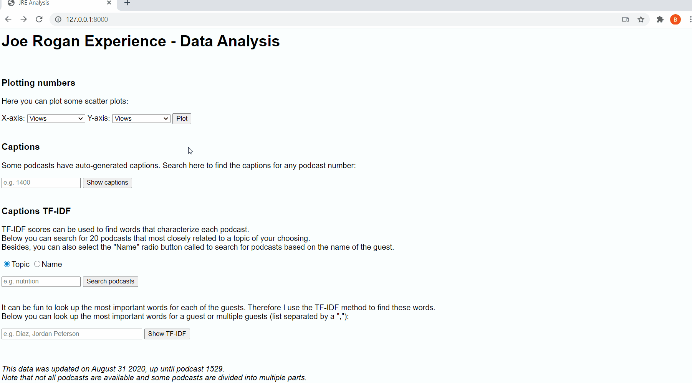
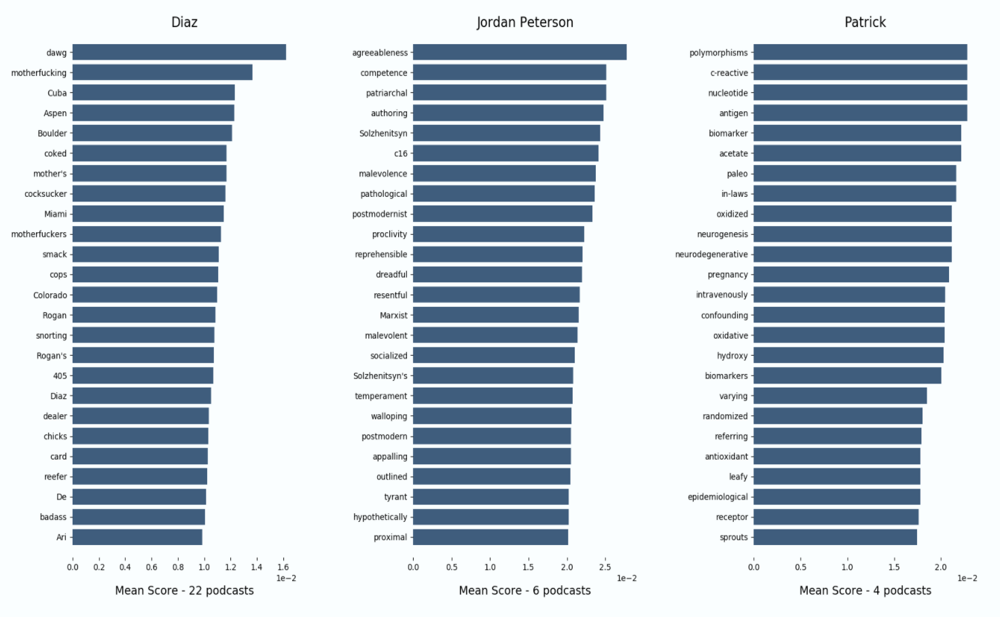

# JREcaptions
This repository contains a small fun project that I did. I am a fan of the Joe Rogan podcasts and love data. Hence I created this project that povides some inights in the data of the JRE podcasts. 
In this project I mostly focus on the auo-generated captions from the videos. 

### Obtianing youtube data
First, I scrape all the titles from the JRE podcasts and use pytube to obtain information for each podcast (up until podcast 1506, in the data: 1403 total podcasts of which 729 have captions). 
Subsequently, I perform multiple operations on the auto-generated English captions. This prepares some further text analysis. 
For instance, I use [Deep Segment](https://github.com/notAI-tech/deepsegment) to make the captions (which don't have any punctuation marks) more readable by splitting the text into segments.

### Django
I convert the dataframes into a sqlite3 table and use this table in Django. In this way one can easily access the information in the database.
There are three ways in which the django app uses the data. First, I create scatter plots of any two numeric variables in the data. 
Second, I show all the captions (after segmentation) for podcasts. 
Finally, I apply TF-IDF on the podcasts grouped by guest. This shows the 25 most important words for each guest.

#### Result:

